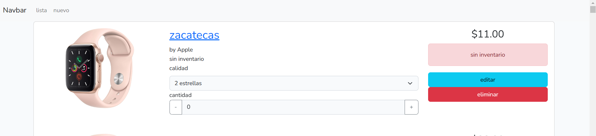

# inventario prueba
## pantalla de inicio

En la pantalla de inicio vera la lista de productos creados y en la parte superior vera el menu con dos opciones, crear y editar.

> el componente podra encontralo en `resources\js\components\listacomponent.vue` y visualizar como se solicita la informacion por axios (ajax)

### puedes

* crear un nuevo producto
* ver los detalles del producto en en link del nombre
* editar el producto
* eliminar el producto
* cambiar la cantidad de producto
    * por concecuencia el estado del producto cambiar a `con inventario`
*  cambiar las estrellas del producto
    * el estado del producto esta sujeto a la cantida disponible si la cantidad es 0 este se pondra como sin inventario.
## pantalla de detalle

> puedes abrilo presionando el link del nombre. el componente puede ser encontrado en `resources\js\components\listacomponent.vue`

* la ventalla detalle muestra la informacion mas relevante del prodcto.

### puede
* visualizar la infrmacion mas relevante, sin distraccion

## pantalla crear y editar producto
La pantalla de editar y crear son la misma la unico que hacen es cargar informacion o dejar el forumario en blanco.
## puedes
* actualizar los datos del producto
* no se puede actualiza la imagen (solo es de muestra)

[regresar](../README.md)